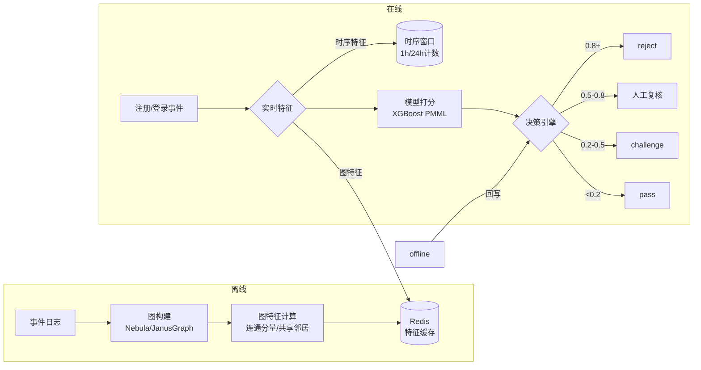

# 反欺诈实战：关系图谱、实时特征与决策引擎的三角协作

> 反欺诈不是"多写几条规则"的事——黑产在进化，你的规则昨天有效不代表今天有效。这篇文章讲的是工程层怎么搭一套能自演化的反欺诈体系。

---

## 1. 为什么规则引擎打不过黑产？

典型的反欺诈演进路径：

```
V1.0：if (同一设备注册 > 3 次) → 拒绝 → 黑产换设备 → 绕过
V2.0：if (同一IP注册 > 5 次) → 拒绝 → 黑产换IP池 → 绕过
V3.0：if (同一设备 OR 同一IP) → 拒绝 → 黑产用设备指纹伪造 → 绕过
...
```

每加一条规则，黑产换一种绕过方式。规则引擎的致命短板：**只看单点特征，不看关系结构**。

反欺诈真正的突破点不在"更多规则"，而在**关系图谱**——把用户、设备、IP、银行卡、手机号抽象为图节点，把注册/登录/交易抽象为边，用图算法发现异常聚集模式。

---

## 2. 关系图谱：从"点"到"网"

### 2.1 构图

```python
# 每个事件产生边，实时写入图数据库
def build_graph_edge(event):
    """
    event = {
        "user_id": "U12345",
        "device_id": "D_abc123",
        "ip": "10.0.0.1",
        "phone": "13800138000",
        "event_type": "register",
        "timestamp": "2024-07-25T10:30:00"
    }
    """
    g = get_graph_connection()

    # 节点：user / device / ip / phone
    g.merge_vertex("User", {"id": event["user_id"]})
    g.merge_vertex("Device", {"id": event["device_id"]})
    g.merge_vertex("IP", {"id": event["ip"]})
    g.merge_vertex("Phone", {"id": event["phone"]})

    # 边：user → device / ip / phone（带时间戳属性）
    g.merge_edge("REGISTERED_ON", event["user_id"], event["device_id"],
                 {"timestamp": event["timestamp"]})
    g.merge_edge("USED_IP", event["user_id"], event["ip"],
                 {"timestamp": event["timestamp"]})
    g.merge_edge("BOUND_PHONE", event["user_id"], event["phone"],
                 {"timestamp": event["timestamp"]})
```

构图完成后，黑产的行为模式在图上一目了然：**正常用户的图是碎片化的孤岛，黑产的图是一个紧密连接的大连通分量**。

### 2.2 两个最实用的图特征

**特征 1：一度共享邻居数（Shared Neighbors）**

```python
def shared_device_count(graph, user_a, user_b):
    """两个用户共用过多少设备"""
    devices_a = set(graph.neighbors(user_a, edge_type="REGISTERED_ON"))
    devices_b = set(graph.neighbors(user_b, edge_type="REGISTERED_ON"))
    return len(devices_a & devices_b)
```

黑产会用同一个设备注册多个账号——`shared_device_count > 0` 几乎 100% 是同一批黑产。

**特征 2：连通分量大小（Connected Component Size）**

```python
def component_size(graph, user_id, max_depth=3):
    """从该用户出发，3 跳内能到达多少个节点"""
    visited = set()
    queue = [(user_id, 0)]
    while queue:
        node, depth = queue.pop(0)
        if node in visited or depth > max_depth:
            continue
        visited.add(node)
        queue.extend((n, depth + 1) for n in graph.neighbors(node))
    return len(visited)
```

正常用户 3 跳内连通几十个节点。黑产团伙 3 跳内可能成千上万——这就是图特征的威力：**单点上无异常，聚集就是铁证**。

---

## 3. 实时特征：你只有 200ms

注册场景的 SLA 通常 200ms 以内。图查询是全量遍历，直接嵌进实时链路必然超时。解法：**离线算特征 → 在线读特征**。

```python
# 离线任务（每小时跑一次）
def offline_compute_graph_features():
    g = get_graph_connection()
    for user in g.scan_vertex("User"):
        features = {
            "shared_device_with": [],       # 共享设备的关联账号
            "component_size_3hop": component_size(g, user, 3),
            "degree_1hop": len(g.neighbors(user)),
        }
        redis.hset(f"graph_feat:{user}", mapping=features)

# 在线决策（200ms 内）
def realtime_anti_fraud(event):
    user_id = event["user_id"]

    # 1. 读离线预计算的图特征（Redis，< 1ms）
    graph_feat = redis.hgetall(f"graph_feat:{user_id}")

    # 2. 算实时比率特征（< 5ms）
    window_1h = count_events(user_id, window="1h")
    window_24h = count_events(user_id, window="24h")

    # 3. 组装特征向量 → 模型打分（< 50ms）
    feature_vector = [
        int(graph_feat.get("component_size_3hop", 0)),
        int(graph_feat.get("degree_1hop", 0)),
        window_1h,
        window_24h,
        window_1h / max(window_24h, 1),  # 短时爆发比
    ]
    score = fraud_model.predict([feature_vector])[0]

    # 4. 决策（< 10ms）
    if score > 0.8:
        return "reject"
    elif score > 0.5:
        return "manual_review"
    else:
        return "pass"
```

**关键设计**：图特征离线算、Redis 在线读——图遍历在离线链路完成，在线链路上只有一次 Redis HGETALL。

---

## 4. 决策引擎：不要只判黑白

只判 `reject / pass` 的太粗糙了。真实业务需要**灰度处理带**：

| 分数区间 | 动作 | 业务含义 |
|---------|------|---------|
| [0.8, 1.0] | reject | 铁定黑产，直接拒绝 |
| [0.5, 0.8) | manual_review | 可疑但不致死，人工复核 |
| [0.2, 0.5) | challenge | 滑块验证/短信验证码 |
| [0, 0.2) | pass | 正常用户 |

`challenge` 带尤其重要——它是对黑产最大的消耗。你不需要阻挡所有黑产，你只需要让攻击成本 > 收益。滑块验证对正常用户多 2 秒，对黑产意味着不能再全自动脚本攻击。

### 决策代码

```python
def make_decision(score: float, user_history: dict) -> dict:
    if score >= 0.8:
        return {"action": "reject", "reason": "high_risk_graph_pattern"}
    elif score >= 0.5:
        return {"action": "manual_review", "reason": "suspicious_cluster"}
    elif score >= 0.2:
        # 白名单用户跳过 challenge
        if user_history.get("challenge_passed_today"):
            return {"action": "pass"}
        return {"action": "challenge", "type": "slider"}
    else:
        return {"action": "pass"}
```

---

## 5. 模型选型：XGBoost 还够用

反欺诈场景的模型不需要很重：

| 模型 | 适用场景 | 延迟 |
|------|---------|------|
| XGBoost | 在线打分首选，特征 < 200 维 | < 5ms |
| GNN (GraphSAGE) | 需要端到端图表示学习 | 50-100ms |
| 规则引擎 (Drools) | 兜底规则，确定性拦截 | < 1ms |

大多数团队不需要 GNN——图特征已经足够强。一个 50 特征的 XGBoost，加上离线图特征，AUC 轻松上 0.92。

```python
import xgboost as xgb

# 训练
model = xgb.XGBClassifier(
    n_estimators=100,
    max_depth=5,
    learning_rate=0.1,
    scale_pos_weight=len(negatives) / len(positives),  # 正负样本不平衡
    eval_metric="auc",
)
model.fit(X_train, y_train)

# 导出为 PMML → 在线推理
from sklearn2pmml import PMMLPipeline, sklearn2pmml
pipeline = PMMLPipeline([("classifier", model)])
sklearn2pmml(pipeline, "fraud_model.pmml")
```

PMML 的好处：Java 服务端直接加载，不需要 Python 运行时，推理延迟 < 5ms。

---

## 6. 一张图总结三角协作



---

## 7. 关键决策清单

- [ ] 构图是否有 device / IP / phone 三个维度？（缺一个黑产就能绕）
- [ ] 图特征是离线算还是在线算？（在线算图算法必超时）
- [ ] 决策是否分了至少三档（reject / challenge / pass）？（二分太粗糙）
- [ ] 是否有白名单机制（已通过验证的用户不再 challenge）？
- [ ] 模型导出格式是否与在线服务兼容（PMML/ONNX）？
- [ ] 特征是否有"短时爆发比"？（1 小时 / 24 小时，反应用户行为突变）

最后一条最容易被忽视——黑产不会按你的节奏慢慢来，他们会在 1 小时内狂注 1000 个账号然后撤离。短时爆发比是抓住这种行为的核心特征。

---

*下一篇预告：AI 应用方向——「Agent 工作流设计：多轮推理、工具编排与状态管理」*
