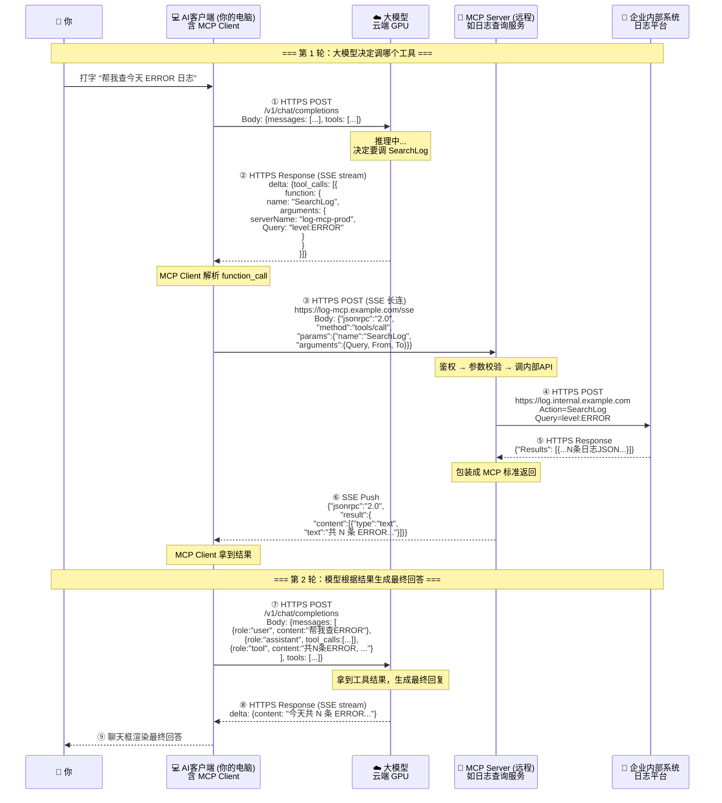

# MCP 全面理解：从架构到数据流的全景解析

> MCP 不是"又一个 API 协议"，它是大模型与外部世界之间的**标准插座**——有了它，换个模型就像换个电器，插头不变，照常用。

---

## 1. MCP 是什么？

**MCP（Model Context Protocol，模型上下文协议）** 是大模型（LLM）与外部工具/数据源之间的标准化通信协议。由 Anthropic 提出，现在已是 AI 工具生态的事实标准。

### 要理解 MCP，先看没有它时是怎么干的

```
┌─────────────────────────────────────────────────────┐
│  没有 MCP 的时代：每个模型×每个工具 = 一对一定制适配      │
│                                                     │
│  模型A  ─── 定制适配 ───▶ 查日志工具                   │
│  模型B  ─── 定制适配 ───▶ 查日志工具  (又写一遍)       │
│  模型A  ─── 定制适配 ───▶ 查数据库工具 (又写一遍)       │
│  模型B  ─── 定制适配 ───▶ 查数据库工具 (又写一遍)       │
│                                                     │
│  复杂度：M×N  O(M×N)                                 │
└─────────────────────────────────────────────────────┘

┌─────────────────────────────────────────────────────┐
│  有了 MCP 之后：所有模型用同一套标准调所有工具           │
│                                                     │
│  任何一个模型 ─── MCP 标准协议 ───▶ 任何一个 MCP Server │
│                                                     │
│  复杂度：M+N  O(M+N)                                 │
└─────────────────────────────────────────────────────┘
```

**说白了就是**：USB-C 出来之前，每个手机有自己的充电口——苹果用 Lightning、安卓有的用 Micro-USB、有的用 USB-C。你出门得带三根线。MCP 就是 AI 世界的 USB-C：**一套标准协议，所有模型和所有工具都能对接**。

---

## 2. MCP 干什么？

MCP 让大模型能**安全、标准化地**做三类事：

| 能力 | 干什么 | 举例 |
|------|--------|------|
| **Resources（资源）** | 暴露数据/文件给模型读 | 让模型读取你的项目代码、配置文件、数据库 schema |
| **Tools（工具）** | 让模型调用外部功能 | 查日志、搜知识库、操作 K8S、创建 TAPD 需求 |
| **Prompts（提示模板）** | 预定义交互模板 | "帮我审查这段代码的安全性"——模板化复用 |

**最常用的场景就是 Tools**：模型说"我要查一下日志"，你的本地客户端帮它调了，把结果喂回去，模型据此生成最终回答。

---

## 3. 系统架构全景图

一个完整的 MCP 体系包含四层：

```
┌──────────────────────────────────────────────────────────────┐
│                          云端                                │
│  ┌────────────────────┐                                      │
│  │   大模型 (LLM)       │   OpenAI / Claude / DeepSeek / ...  │
│  │   运行在云端 GPU     │                                      │
│  └─────────┬──────────┘                                      │
│            │ HTTPS (SSE 流式)                                 │
│            │ function_call ← ── → 工具结果                    │
│            ▼                                                 │
│  ┌─────────────────────┐     你的电脑                        │
│  │  AI 客户端 (桌面IDE)  │                                      │
│  │  ┌───────────────┐  │                                      │
│  │  │  MCP Client   │  │  ← 内置模块，TypeScript 实现         │
│  │  │  ①工具发现      │  │                                      │
│  │  │  ②调用转发      │  │                                      │
│  │  │  ③结果回传      │  │                                      │
│  │  └───┬───────┬───┘  │                                      │
│  │      │       │      │                                      │
│  │   stdio     SSE     │                                      │
│  │   (本地)   (远程)    │                                      │
│  └──────┼───────┼──────┘                                      │
│         │       │                                             │
│         ▼       ▼                                             │
│  ┌──────────┐ ┌──────────────────┐                           │
│  │MCP Server│ │  MCP Server      │  远程服务                   │
│  │(本地进程) │ │  (部署在云/机房)   │                           │
│  │          │ │                  │                           │
│  │浏览器自动化│ │  查日志 / K8S    │                           │
│  │文件系统   │ │  数据库 / Git    │                           │
│  └──────────┘ └────────┬─────────┘                           │
│                        │ HTTPS                                │
│                        ▼                                     │
│              ┌──────────────────┐                            │
│              │   企业内部系统     │                            │
│              │ 日志平台/K8S/DB   │                            │
│              │ 知识库/Git/需求系统│                            │
│              └──────────────────┘                            │
└──────────────────────────────────────────────────────────────┘
```

**四层角色速查**：

| 层级 | 是什么 | 跑在哪儿 | 一句话 |
|------|--------|---------|--------|
| **大模型** | 大脑 | 云端 GPU | 理解你的意图，输出 function_call 指令，自己不调任何外部系统 |
| **MCP Client** | 手脚 | 你的电脑 | 接收指令 → 找到对应 Server → 转发 → 拿到结果 → 喂回模型 |
| **MCP Server** | 工具人 | 远端机房 / 你本机 | 收 JSON-RPC，调内部 API，返回结果 |
| **企业系统** | 数据源 | 企业内网 | 日志、数据库、K8S——MCP Server 帮你取出来的那口井 |

---

## 4. 一次完整调用的 HTTP 数据流（8 跳）

假设你让 AI "帮我查一下生产环境今天 14:00 之后的错误日志"：



**每一跳都是真实的 HTTPS 请求**，一次对话 = 4 次独立的 HTTPS 往返：

| 跳 | 方向 | 干什么 |
|----|------|--------|
| ①→② | 客户端 ↔ 大模型 | 把你的问题 + 可用工具清单发给模型 |
| ③→⑥ | 客户端 → MCP Server → 内部系统 → MCP Server → 客户端 | 一整条工具调用链路 |
| ⑦→⑧ | 客户端 ↔ 大模型 | 把工具结果喂给模型，生成最终文本 |
| ⑨ | 客户端 → 你 | 渲染到聊天框 |

---

## 5. MCP Client 详细拆解

### 5.1 它在哪里？

MCP Client 是你桌面 AI 应用（如 VS Code 插件、独立 IDE）**内置的一个模块**，不需要你单独安装。你不是装了一个"MCP Client"，而是你用的 AI 编程工具出厂就带。

### 5.2 它用什么语言写的？

通常是 **TypeScript**，因为主流 AI 编程工具基于 **VS Code / Electron** 生态（Chromium 渲染 + Node.js 后端），整个客户端体系的代码都是 TypeScript/JavaScript。

### 5.3 它干四件事

```
┌──────────────────────────────────────────────────────┐
│                 MCP Client 四件套                      │
├──────────┬───────────────────────────────────────────┤
│ ① 发现   │  启动时问每个 Server："你能干啥？"             │
│          │  tools/list → 拿到 {SearchLog, listPods...}│
├──────────┼───────────────────────────────────────────┤
│ ② 上报   │  把工具清单 + 描述发给大模型                   │
│          │  "告诉模型：你能调 SearchLog、listPods..."    │
├──────────┼───────────────────────────────────────────┤
│ ③ 转发   │  模型返回 function_call → 找到对应 Server     │
│          │  → 包装成 JSON-RPC → 发出去                 │
├──────────┼───────────────────────────────────────────┤
│ ④ 回传   │  Server 返回结果 → 塞进下一轮对话            │
│          │  → 发给大模型 → 生成最终回答                  │
└──────────┴───────────────────────────────────────────┘
```

**说白了就是**：MCP Client 是大模型的"快递员"——大模型说"去 X 店取货"，Client 就去 X 店拿、再送到大模型面前。它自己不加工货物，只负责运。

---

## 6. 为什么必须经过你的电脑？

```
                大模型 (云端 GPU)
                     │
                     │  ❌ 连不上企业内网
                     │     （网络隔离）
                     ▼
              企业内网系统
          (日志平台 / K8S / DB)

┌────────────────────────────────────┐
│               你的电脑             │
│                                    │
│  ✅ 已登录企业 VPN/OA               │
│  ✅ 能访问所有内网系统               │
│  ✅ 能读本地文件                    │
│                                    │
│  大模型 ------------ 你的电脑 ----- 企业系统   │
│  (决策)              (中转)        (数据)    │
└────────────────────────────────────┘
```

**两条根本原因**：

| 原因 | 说明 |
|------|------|
| **网络隔离** | 大模型跑在独立的 GPU 集群，与企业内网是隔离的。你的电脑有登录凭证和网络权限 |
| **文件系统** | 大模型看不到你本机的代码和文件，只有你本机才能读 `src/main/java/` |

**说白了就是**：大模型是"远程大脑"，你的电脑是"本地手脚"。脑子再聪明，没有手脚也拿不到桌上的东西。

---

## 7. 通信协议：MCP 到底用什么传数据？

MCP 协议本质是 **JSON-RPC 2.0**，包在两种传输方式里：

### 7.1 两种传输方式

| 方式 | 场景 | 怎么通信 | 例子 |
|------|------|---------|------|
| **stdio** | MCP Server 在你本机 | `child_process.spawn()` 起子进程<br/>stdin/stdout 传 JSON | 浏览器自动化、本地文件操作 |
| **SSE** (Server-Sent Events) | MCP Server 在远端 | HTTP 长连接<br/>Client→Server 用 POST<br/>Server→Client 用 SSE Push | 企业日志查询、K8S 管理、数据库操作 |

### 7.2 stdio 模式（本地）

```
CodeBuddy (MCP Client)
  │
  │  child_process.spawn("npx", ["@browser-mcp/server"])
  │  stdin:  {"jsonrpc":"2.0","method":"tools/call",...}
  │  stdout: {"jsonrpc":"2.0","result":{...}}
  ▼
browser-mcp-server (本地 node 进程)
  │
  │  启动 Chromium
  ▼
浏览器窗口 → 截图/点击/填表
```

**特点**：不走网络，纯管道通信，零延迟，数据不离开本机。

### 7.3 SSE 模式（远程）

```
MCP Client                         MCP Server (远程)
    │                                    │
    │── HTTP POST /sse ──────────────────▶│ (建立 SSE 长连接)
    │◀── SSE: endpoint event ───────────│ (告诉 Client 往哪发请求)
    │                                    │
    │── HTTP POST /message ─────────────▶│ (发送 JSON-RPC 调用)
    │◀── SSE: message event ────────────│ (返回结果)
```

**特点**：走 HTTP，适合跨网络。Client 维护一条 SSE 长连接收推送，POST 请求发调用。

### 7.4 与 REST API 的本质区别

| | REST API | MCP |
|--|---------|-----|
| 调用方式 | 你写死 "调 /api/logs/search" | 模型动态决定"我要调 SearchLog" |
| 工具发现 | 无——你要预先知道有哪些端点 | 有 `tools/list` ——启动时自动发现 |
| 谁决策 | 你（程序）决定什么时候调什么 | 模型根据上下文推理决定 |
| 返回值 | 直接给调用方 | 先回到 Client → 再喂给模型 → 模型据此生成回答 |

**说白了就是**：REST API 是你写代码去调，MCP 是让大模型替你做"我该调哪个工具"的决策。

---

## 8. MCP vs Function Calling

容易被搞混的一对概念：

| | Function Calling | MCP |
|--|-----------------|-----|
| 是什么 | 大模型的一项**能力**（能输出函数调用指令） | 一套**协议标准**（定义了 Client ↔ Server 怎么通信） |
| 管什么 | "模型输出 function_call 这个动作" | "从发现工具到调用工具到回传结果的全链路" |
| 谁实现 | 模型提供商（OpenAI/Anthropic/DeepSeek） | 工具提供方（日志平台、K8S、DB 团队各自写 Server） |
| 说了算的 | 模型厂商定义的 function_call 字段格式 | MCP 协议定义的 JSON-RPC 消息规范 |

**关系**：Function Calling 是模型层面的"我能说要调什么"，MCP 是通信层面的"谁来调、怎么调、结果怎么回"。两者配合使用。

---

## 9. 一个 MCP Server 内部长什么样？

以"日志查询 MCP Server"为例：

```
┌─────────────────────────────────────────────┐
│         log-mcp-server (Node/Go/Python)      │
│                                              │
│  ┌──────────┐   ┌──────────┐   ┌─────────┐ │
│  │ 鉴权层    │   │ 路由层    │   │ 适配层  │ │
│  │          │   │          │   │         │ │
│  │ 提取token│→  │ tools/   │→  │ 调内部  │ │
│  │ 验证身份  │   │ list     │   │ 日志API │ │
│  │ 权限校验  │   │ tools/   │   │ 格式转换│ │
│  └──────────┘   │ call     │   │ 错误处理│ │
│                 └──────────┘   └─────────┘ │
│                                              │
│  注册的工具：                                  │
│  • SearchLog(topicId, query, from, to)       │
│    → 查日志                                   │
│  • GetTopicInfo(topicName)                    │
│    → 查日志主题信息                            │
│  • TextToSearchQuery(naturalLanguage)         │
│    → 自然语言转日志查询语法                     │
└─────────────────────────────────────────────┘
```

每个 MCP Server 启动时向 Client 声明自己提供哪些工具（`tools/list`），Client 记录下来上报给大模型。当大模型说"调 SearchLog"时，Client 就把参数打包成 JSON-RPC 发过来，Server 执行并返回结果。

---

## 10. 三种典型部署拓扑

### 拓扑 A：全本地

```
你的电脑
├── AI 客户端 (含 MCP Client)
├── MCP Server (本地进程) ─── 操作浏览器 / 读写文件
└── (不走网络)
```

**场景**：浏览器自动化截图、本地文件批量处理。

### 拓扑 B：本地 + 远程混合

```
你的电脑                         远端
├── AI 客户端 (含 MCP Client)
│    ├──→ stdio → 本地 MCP Server (浏览器操作)
│    └──→ SSE  → 远程 MCP Server → 企业日志平台
│                 远程 MCP Server → 企业 K8S 集群
│                 远程 MCP Server → 企业 Git 仓库
```

**场景**：日常编程助手——既需要读本地代码，又需要查线上日志、看 Pod 状态。

### 拓扑 C：纯云端（Agent 模式）

```
云端 Agent 平台
├── MCP Client
└──→ SSE → 远程 MCP Server → 企业系统

(不需要用户在电脑前，定时任务 / 自动触发)
```

**场景**：定时巡检（每天 9 点自动查日志告警）、自动化运维。

---

## 11. 总结：三句话记住 MCP

| | |
|---|---|
| **它是什么** | 大模型与外部世界之间的标准通信协议，像 USB-C 一样统一了"模型 ↔ 工具"的对接方式 |
| **它干什么** | 让大模型能**发现**有什么工具可用 → **决定**调哪个 → **拿到**结果 → **生成**最终回答 |
| **数据怎么流** | `大模型(function_call) → MCP Client(转发JSON-RPC) → MCP Server(调内部API) → MCP Client(回传) → 大模型(生成回答)`，全程 HTTPS，你的电脑是必经中转站 |

**说白了就一句话**：MCP 把"大模型想帮忙但够不到"和"内部系统有数据但听不懂人话"之间的那个断点，用一套标准协议接上了。

---

*写于 2026-07-27 · 基于实际企业级 MCP 落地经验*
