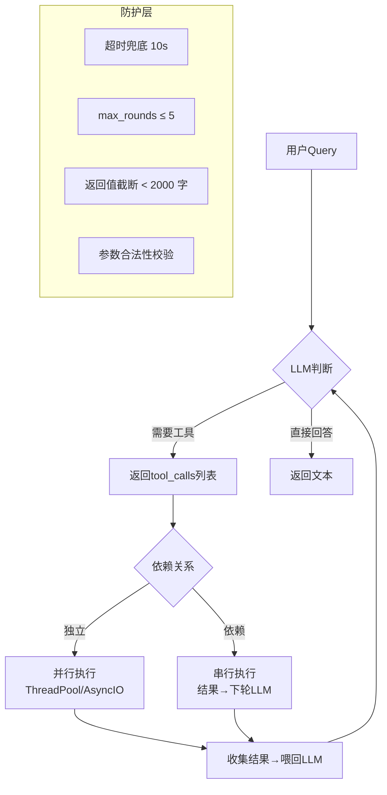

# Function Calling 设计模式：从一次调用到生产级工具编排

> 别再用 `if-else` 解析 LLM 返回的 JSON 来做工具调用了——Function Calling 真正的价值在编排层，不在调用层。

---

## 1. 你是怎么用 Function Calling 的？

大多数人的用法：

```python
# ❌ 做法一：让 LLM 返回 JSON，然后自己 if-else
response = llm.chat("用户想查北京天气")
tool_name = json.loads(response)["tool"]
if tool_name == "get_weather":
    result = get_weather("北京")
elif tool_name == "get_stock":
    result = get_stock("000001")
```

这不是 Function Calling——这是在用 LLM 做意图识别 + if-else 路由。问题很明显：每加一个工具就要改代码，工具之间的调用链只能硬编码。

真正的 Function Calling，让 LLM 决定**调用哪个工具**、**传什么参数**、以及**调用结果怎么用**。你只需描述工具，不写路由逻辑。

---

## 2. 三步理解 Function Calling 的本质

```
用户: "帮我查一下北京今天天气，如果下雨就提醒我带伞"

Step 1: LLM 决定调用 get_weather(city="北京")
         → 返回 function_call，不返回文字

Step 2: 你的代码执行 get_weather("北京")
         → 拿到 {"weather": "小雨", "temp": 22}

Step 3: 把结果喂回 LLM，LLM 生成最终回复
         → "北京今天小雨，22°C，记得带伞！"
```

说白了就三步：**LLM 说"我要调这个" → 你调了 → 结果还给 LLM**。LLM 负责决策，你负责执行。路由逻辑不在你代码里，在模型推理里。

---

## 3. 工具定义：描述比实现重要

工具定义不是给代码看的，是给 LLM 看的。写得好坏直接影响调用准确率：

```python
tools = [
    {
        "type": "function",
        "function": {
            "name": "get_weather",
            "description": "获取指定城市的实时天气信息。返回包含天气状况、温度(℃)、湿度的 JSON",
            "parameters": {
                "type": "object",
                "properties": {
                    "city": {
                        "type": "string",
                        "description": "城市中文名，如'北京'、'上海'。不要传拼音或英文"
                    }
                },
                "required": ["city"]
            }
        }
    }
]
```

### 三个血的教训

**教训 1：description 要写返回值结构**。LLM 需要知道调用后能得到什么，才能判断"值不值得调"。只写"获取天气"不够，要写"返回天气状况、温度、湿度"。

**教训 2：参数 description 要包含反例**。`"城市中文名，如'北京'、'上海'。不要传拼音或英文"` — 这个"不要传"很关键。LLM 默认倾向用英文，不加反例大概率传 `"Beijing"`。

**教训 3：required 字段要精准**。把不该 required 的标成 required，LLM 会强行编造值来满足约束。比如地址查询把 `street` 标成 required，用户只说"朝阳区"，LLM 就会编个 `"朝阳路 1 号"`。

---

## 4. 并行调用：让 LLM 一次调多个工具

真实场景很少只调一个工具。"帮我比较北京和上海的天气"——这是两个独立查询，应该并行：

```python
# OpenAI 的 parallel_tool_calls 默认开启
response = client.chat.completions.create(
    model="gpt-4o",
    messages=[{"role": "user", "content": "比较北京、上海、广州今天的天气"}],
    tools=tools,
    tool_choice="auto"  # LLM 自己决定是否调、调几个
)

# 可能返回 3 个 tool_calls，你的代码并发执行
import concurrent.futures

def execute_tool_call(tc):
    args = json.loads(tc.function.arguments)
    func = TOOL_MAP[tc.function.name]
    return tc.id, func(**args)

with concurrent.futures.ThreadPoolExecutor() as executor:
    futures = [executor.submit(execute_tool_call, tc) for tc in response.choices[0].message.tool_calls]
    results = {f.result()[0]: f.result()[1] for f in futures}

# 把所有结果一次性喂回 LLM
```

**关键细节**：每个 tool_call 有唯一 `id`，返回结果时要把 `tool_call_id` 对上。LLM 靠这个 id 区分"这个结果是哪个调用的"——错了会导致 LLM 张冠李戴。

---

## 5. 串行依赖：一个工具的输出是另一个的输入

这是并行搞不定的场景。"查一下马云担任法人的公司最近一年的营收"——必须先查公司名，再查营收。

```python
def run_agent_with_tools(user_query: str, max_rounds: int = 5) -> str:
    messages = [{"role": "user", "content": user_query}]

    for _ in range(max_rounds):
        response = client.chat.completions.create(
            model="gpt-4o",
            messages=messages,
            tools=tools,
            tool_choice="auto"
        )
        msg = response.choices[0].message

        if msg.tool_calls is None:
            return msg.content  # LLM 决定不调了，返回最终答案

        # 追加 assistant 消息（含 tool_calls）
        messages.append(msg)

        # 执行每个 tool_call，结果作为 tool 消息追加
        for tc in msg.tool_calls:
            result = execute_tool(tc)
            messages.append({
                "role": "tool",
                "tool_call_id": tc.id,
                "content": json.dumps(result, ensure_ascii=False)
            })

    return "达到最大轮次，未收敛"
```

`max_rounds` 是安全阀——工具调用链可能无限循环（一个工具返回空，LLM 换另一个工具重试，又返回空……）。生产环境必须设上限。

---

## 6. 结构化输出：不用 JSON 解析了

OpenAI 2024 年推出了 `response_format` + `strict` 模式，但 Function Calling 本身也可以做结构化输出：

```python
tools = [{
    "type": "function",
    "function": {
        "name": "extract_contract_info",
        "description": "从合同文本中提取关键信息",
        "parameters": {
            "type": "object",
            "properties": {
                "parties": {
                    "type": "array",
                    "items": {
                        "type": "object",
                        "properties": {
                            "name": {"type": "string"},
                            "role": {"type": "string", "enum": ["甲方", "乙⽅"]}
                        }
                    }
                },
                "amount": {"type": "number", "description": "合同金额(万元)"},
                "sign_date": {"type": "string", "description": "签署日期 YYYY-MM-DD"}
            },
            "required": ["parties", "amount"]
        }
    }
}]

# 调用时强制使用该函数
response = client.chat.completions.create(
    model="gpt-4o",
    messages=[{"role": "user", "content": contract_text}],
    tools=tools,
    tool_choice={"type": "function", "function": {"name": "extract_contract_info"}}
)

info = json.loads(response.choices[0].message.tool_calls[0].function.arguments)
# info = {"parties": [...], "amount": 500, "sign_date": "2024-03-15"}
```

实际上就是把 Function Calling 当结构化提取器用。好处是不用单独维护 JSON Schema + prompt，一套 tool definition 搞定。

---

## 7. 生产环境三个坑

### 坑 1：工具返回太大，超出 context

```python
def search_documents(query: str, top_k: int = 20) -> list:
    results = vector_store.search(query, k=top_k)
    # 每条结果 2000 字，20 条 = 40000 字 → 轻松超 context
    return [{"title": r.title, "content": r.content[:500]} for r in results]  # 截断
```

工具函数自己要控制返回大小，不要指望 LLM 帮你裁剪。

### 坑 2：工具超时导致整个请求 hang

```python
import signal

def execute_with_timeout(func, args, timeout=10):
    """所有工具调用必须带超时"""
    # 实际用 concurrent.futures 或 asyncio.wait_for
    future = executor.submit(func, **args)
    try:
        return future.result(timeout=timeout)
    except TimeoutError:
        return {"error": "工具调用超时", "timeout": timeout}
```

### 坑 3：LLM 编造参数值

LLM 在 required 字段缺失时会"编"一个。防御：在工具函数里校验：

```python
def get_weather(city: str) -> dict:
    if city not in VALID_CITIES:
        return {"error": f"不支持的城市: {city}，支持的城市: {list(VALID_CITIES)[:10]}"}
    return real_api_call(city)
```

返回错误信息而不是抛异常——这样 LLM 看到 error 后能自动修正重试。

---

## 8. 一张图总结



---

## 关键决策清单

- [ ] 工具 description 写了返回值结构吗？
- [ ] 参数 description 写了反例吗（"不要传 xxx"）？
- [ ] required 字段是否精准（多了 LLM 会编造，少了会漏传）？
- [ ] 独立调用是否用了并行执行？
- [ ] 是否设了 max_rounds 防止无限循环？
- [ ] 工具函数返回是否做了截断（防 context 溢出）？
- [ ] 工具函数是否有超时兜底？
- [ ] 工具函数是否校验了参数合法性（返回 error JSON，不抛异常）？

其中最后四条是区分"能跑"和"能运维"的关键。

---

*下一篇预告：信贷风控方向——「评分卡变量分箱：等频 vs 等距 vs 决策树，选错了代价多大？」*
---