# MCP 全面理解：从架构到数据流的全景解析

> MCP 不是"又一个 API 协议"，它是大模型与外部世界之间的**标准插座**——有了它，换个模型就像换个电器，插头不变，照常用。

---

## 1. MCP 是什么？

**MCP（Model Context Protocol，模型上下文协议）** 是大模型（LLM）与外部工具/数据源之间的标准化通信协议。由 Anthropic 提出，现在已是 AI 工具生态的事实标准。

### 没有 MCP vs 有 MCP

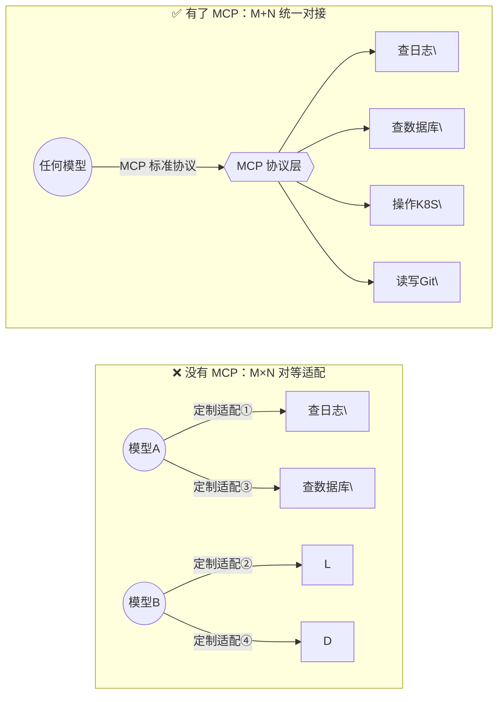

**说白了就是**：USB-C 出来之前，每个手机有自己的充电口——苹果用 Lightning、安卓有的用 Micro-USB、有的用 USB-C。你出门得带三根线。MCP 就是 AI 世界的 USB-C：**一套标准协议，所有模型和所有工具都能对接**。

---

## 2. MCP 干什么？

MCP 让大模型能**安全、标准化地**做三类事：

| 能力 | 干什么 | 举例 |
|------|--------|------|
| **Resources（资源）** | 暴露数据/文件给模型读 | 让模型读取你的项目代码、配置文件、数据库 schema |
| **Tools（工具）** | 让模型调用外部功能 | 查日志、搜知识库、操作 K8S、创建需求 |
| **Prompts（提示模板）** | 预定义交互模板 | "帮我审查这段代码的安全性"——模板化复用 |

**最常用的场景就是 Tools**：模型说"我要查一下日志"，你的本地客户端帮它调了，把结果喂回去，模型据此生成最终回答。

---

## 3. 系统架构全景图

一个完整的 MCP 体系包含四层，用圆形实体 + 箭头的流转图来展示：

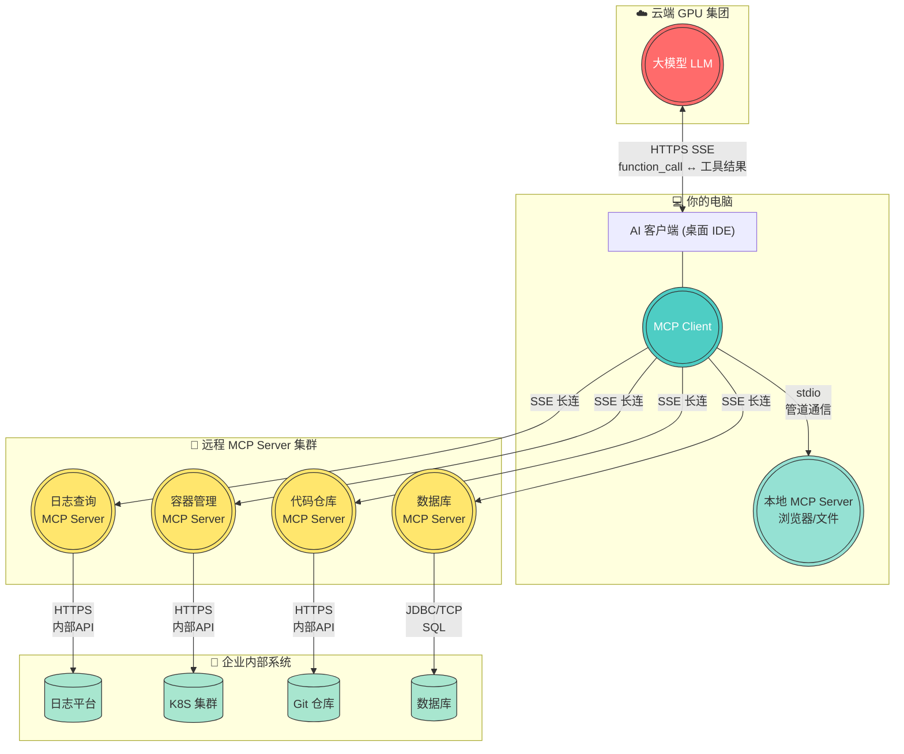

**四层角色速查**：

| 层级 | 是什么 | 跑在哪儿 | 一句话 |
|------|--------|---------|--------|
| **大模型** | 大脑 | 云端 GPU | 理解你的意图，输出 function_call 指令，自己不调任何外部系统 |
| **MCP Client** | 手脚 | 你的电脑 | 接收指令 → 找到对应 Server → 转发 → 拿到结果 → 喂回模型 |
| **MCP Server** | 工具人 | 远端机房 / 你本机 | 收 JSON-RPC，调内部 API，返回结果 |
| **企业系统** | 数据源 | 企业内网 | 日志、数据库、K8S——MCP Server 帮你取出来的那口井 |

---

## 4. Function Calling 是什么？

在讲数据流之前，必须先搞清楚一个关键概念：**Function Calling**。

### 4.1 一句话定义

**Function Calling 是大模型的一项能力——它能"说出"自己要调哪个函数、传什么参数**，但它自己不执行。真正执行的是你本地的代码。

### 4.2 用餐厅点菜来理解

```
你去餐厅：

你：  "给我来一份宫保鸡丁，微辣"       ← 这是你的自然语言问题
厨师：看了一眼菜单，写了个单子：         ← 这是 Function Calling
      ┌─────────────────────┐
      │ 菜名: 宫保鸡丁       │
      │ 辣度: 微辣          │
      │ 数量: 1份           │
      └─────────────────────┘
      然后把单子递给服务员            ← 模型把 function_call 返回给客户端

服务员：拿着单子去厨房，厨师真正炒菜   ← 这是 MCP Client 调 MCP Server

炒好了，服务员端回来给你            ← 结果回传
```

**Function Calling 就是"厨师开单子"这一步——模型只负责决策"该调哪个函数、传什么参数"，真正炒菜（执行）是后面的事。**

### 4.3 实际代码长什么样

大模型返回的不是自然语言，而是一个结构化的 JSON：

```json
{
  "tool_calls": [{
    "function": {
      "name": "SearchLog",
      "arguments": {
        "Query": "level:ERROR",
        "From": 1753574400000,
        "To": 1753660799000
      }
    }
  }]
}
```

关键：**模型只输出这个 JSON，不执行它**。谁执行？——你的客户端拿这个 JSON，去调 MCP Server。

### 4.4 Function Calling 和 MCP 的关系

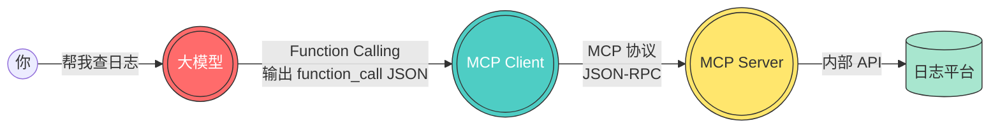

| | Function Calling | MCP |
|--|-----------------|-----|
| 是什么 | 大模型的一项**能力**（能输出函数调用指令） | 一套**协议标准**（定义了 Client ↔ Server 怎么通信） |
| 管什么 | "模型输出 function_call JSON" | "从发现工具到调用工具到回传结果的全链路" |
| 谁实现 | 模型提供商（OpenAI/Anthropic/DeepSeek） | 工具提供方（日志平台、K8S、DB 团队各自写 Server） |
| 谁执行 | **不执行**，只输出指令 | **真正执行**，调内部 API 拿结果 |

**说白了就是**：Function Calling 是"大脑说要干什么"，MCP 是"手脚去把它干了"。大脑只动嘴，手脚才动手。

---

## 5. 一次完整调用的 HTTP 数据流（8 跳）

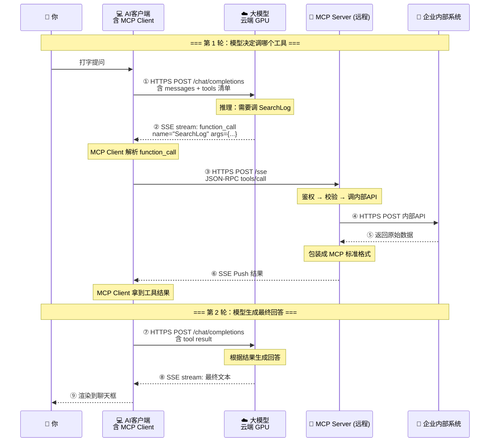

**每一跳都是真实的 HTTPS 请求**，一次对话 = 4 次独立的 HTTPS 往返：

| 跳 | 方向 | 干什么 |
|----|------|--------|
| ①→② | 客户端 ↔ 大模型 | 把你的问题 + 可用工具清单发给模型 |
| ③→⑥ | 客户端 → MCP Server → 内部系统 → MCP Server → 客户端 | 一整条工具调用链路 |
| ⑦→⑧ | 客户端 ↔ 大模型 | 把工具结果喂给模型，生成最终文本 |
| ⑨ | 客户端 → 你 | 渲染到聊天框 |

### 流转路径总结

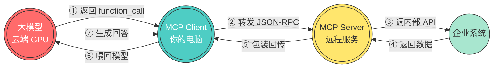

---

## 6. MCP Client 详细拆解

### 6.1 它在哪里？

MCP Client 是你桌面 AI 应用（如 VS Code 插件、独立 IDE）**内置的一个模块**，不需要你单独安装。

### 6.2 它用什么语言写的？

通常是 **TypeScript**，因为主流 AI 编程工具基于 **VS Code / Electron** 生态（Chromium 渲染 + Node.js 后端）。

### 6.3 它干四件事

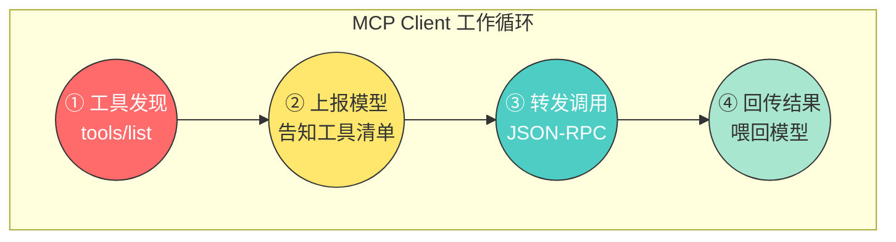

| 步骤 | 干什么 | 具体动作 |
|------|--------|---------|
| ① 发现 | 启动时问每个 Server "你能干啥？" | `tools/list` → `{SearchLog, listPods, getFile...}` |
| ② 上报 | 把工具清单发给大模型 | "告诉模型：你能调这些工具，每个的参数是..." |
| ③ 转发 | 模型说"调 SearchLog" → 找到对应 Server → 发 JSON-RPC | 包装参数 → `{"jsonrpc":"2.0", "method":"tools/call", ...}` |
| ④ 回传 | Server 返回结果 → 塞进下一轮对话 → 发给模型 | `{role:"tool", content:"共N条ERROR..."}` → 模型 → 最终回答 |

**说白了就是**：MCP Client 是大模型的"快递员"——大模型说"去 X 店取货"，Client 就去 X 店拿、再送到大模型面前。它自己不加工货物，只负责运。

---

## 7. 为什么必须经过你的电脑？

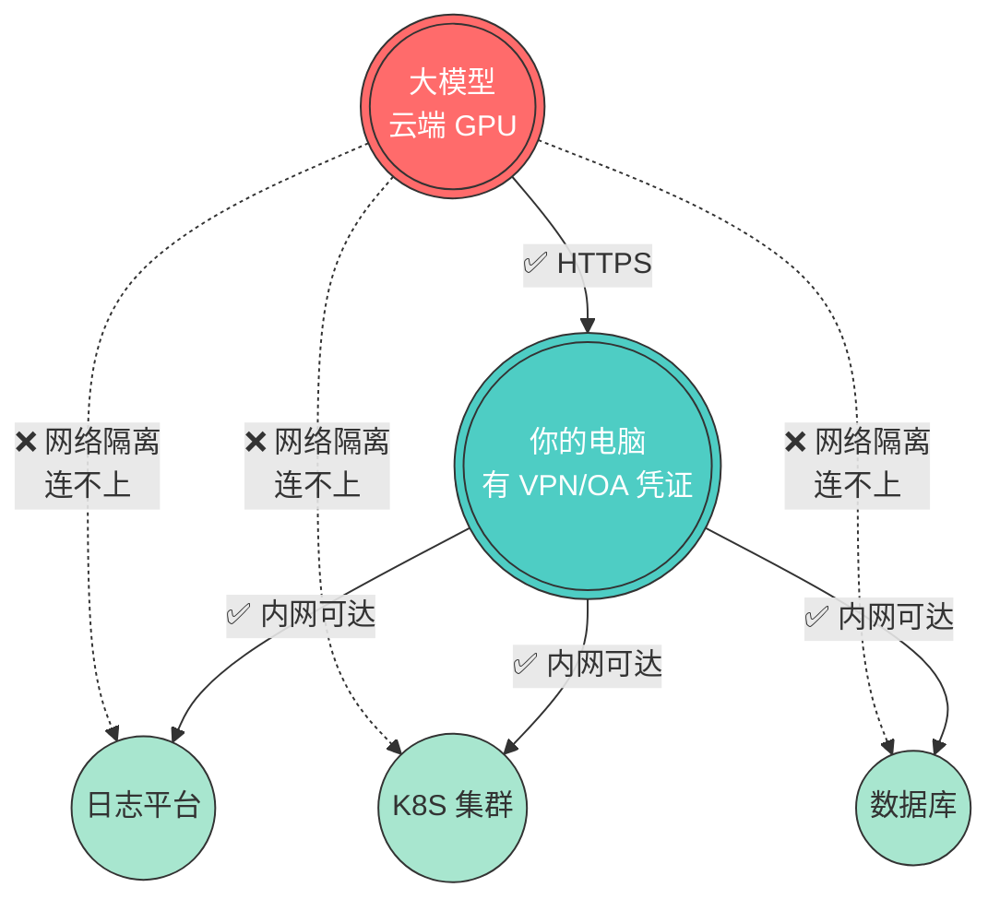

**两条根本原因**：

| 原因 | 说明 |
|------|------|
| **网络隔离** | 大模型跑在独立的 GPU 集群，与企业内网是隔离的。你的电脑有登录凭证和网络权限 |
| **文件系统** | 大模型看不到你本机的代码和文件，只有你本机才能读本地项目文件 |

**说白了就是**：大模型是"远程大脑"，你的电脑是"本地手脚"。脑子再聪明，没有手脚也拿不到桌上的东西。

---

## 8. 通信协议：MCP 到底用什么传数据？

MCP 协议本质是 **JSON-RPC 2.0**，包在两种传输方式里：

### 8.1 两种传输方式

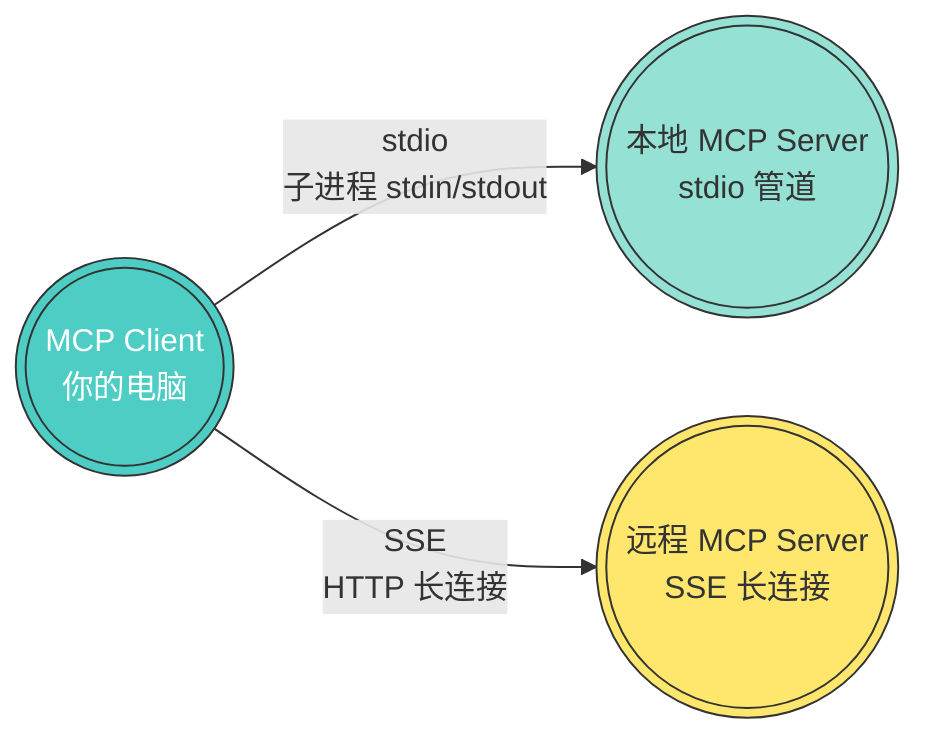

| 方式 | 场景 | 怎么通信 | 例子 |
|------|------|---------|------|
| **stdio** | MCP Server 在你本机 | `child_process.spawn()` 起子进程<br/>stdin/stdout 传 JSON | 浏览器自动化、本地文件操作 |
| **SSE** (Server-Sent Events) | MCP Server 在远端 | HTTP 长连接<br/>Client→Server 用 POST<br/>Server→Client 用 SSE Push | 日志查询、K8S 管理、数据库操作 |

### 8.2 stdio 模式（本地管道通信）

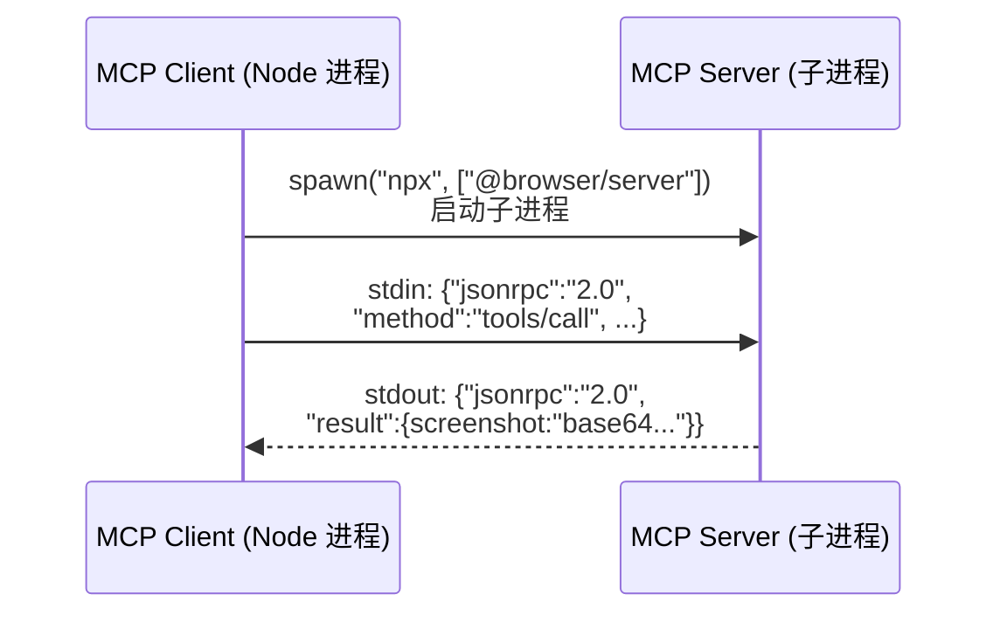

**特点**：不走网络，纯管道通信，零延迟，数据不离开本机。

### 8.3 SSE 模式（远程 HTTP 通信）

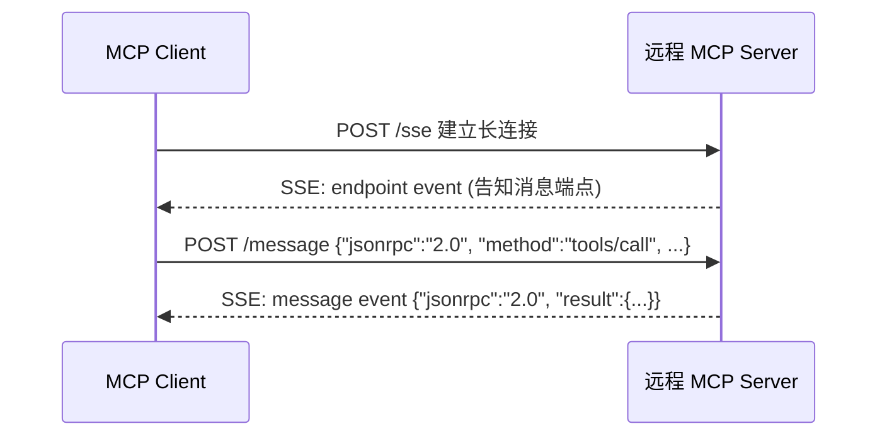

**特点**：走 HTTP，适合跨网络。Client 维护一条 SSE 长连接收推送，POST 请求发调用。

### 8.4 与 REST API 的本质区别

| | REST API | MCP |
|--|---------|-----|
| 调用方式 | 你写死 "调 /api/logs/search" | 模型动态决定"我要调 SearchLog" |
| 工具发现 | 无——你要预先知道有哪些端点 | 有 `tools/list` ——启动时自动发现 |
| 谁决策 | 你（程序）决定什么时候调什么 | 模型根据上下文推理决定 |
| 返回值 | 直接给调用方 | 先回到 Client → 再喂给模型 → 模型据此生成回答 |

**说白了就是**：REST API 是你写代码去调，MCP 是让大模型替你做"我该调哪个工具"的决策。

---

## 9. MCP vs Function Calling（总结对比）

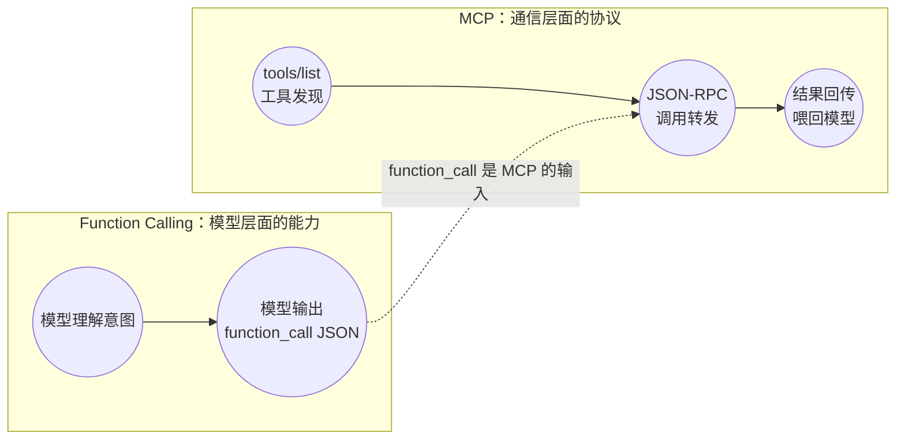

| 维度 | Function Calling | MCP |
|------|-----------------|-----|
| **层面** | 模型能力层 | 通信协议层 |
| **谁实现** | 模型厂商（OpenAI/Anthropic/DeepSeek） | 工具平台团队（日志/K8S/DB 各写各的 Server） |
| **产出** | 一个 function_call JSON | 一个完整的工具调用生命周期 |
| **类比** | "厨师开菜单" | "服务员接单 → 厨房炒菜 → 上菜" |
| **能独立工作吗** | 不能——光开单子没人炒菜 | 不能——没有 function_call 不知道要调哪个工具 |

**说白了就是**：Function Calling 是"大脑说要干什么"，MCP 是"手脚去把它干了"。两者配合：大脑动嘴开单子（function_call），手脚按单子跑腿执行（MCP）。

---

## 10. 一个 MCP Server 内部长什么样？

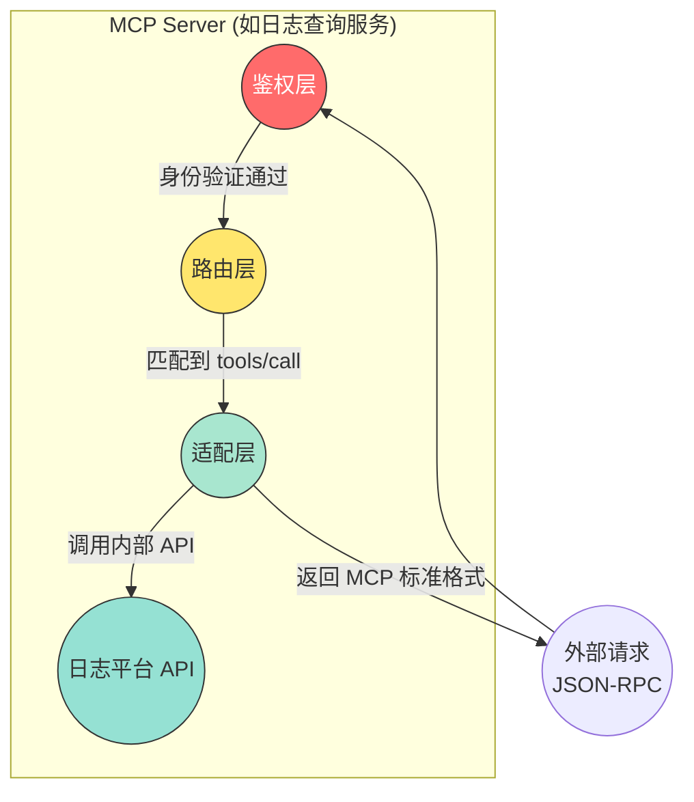

| 层 | 职责 |
|----|----|
| **鉴权层** | 提取 token → 验证身份 → 权限校验 |
| **路由层** | 解析 `method: tools/call` → 匹配到具体工具函数 |
| **适配层** | 调内部 API → 格式转换 → 错误处理 → 包装成 MCP 返回格式 |

注册的工具示例：
- `SearchLog(query, from, to)` → 查日志
- `GetTopicInfo(name)` → 查日志主题
- `TextToSearchQuery(naturalLanguage)` → 自然语言转查询语法

---

## 11. 三种典型部署拓扑

### 拓扑 A：全本地

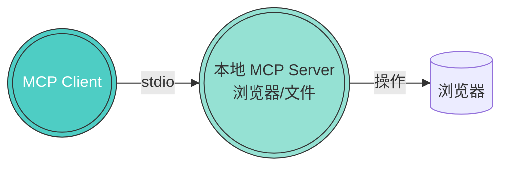

**场景**：浏览器自动化截图、本地文件批量处理。

### 拓扑 B：本地 + 远程混合（最常见）

```mermaid
graph TB
    MC((("MCP Client\n你的电脑")))
    MC -->|"stdio"| LOCAL((("本地 Server\n浏览器")))
    MC -->|"SSE"| R1((("日志\nServer")))
    MC -->|"SSE"| R2((("K8S\nServer")))
    MC -->|"SSE"| R3((("Git\nServer")))
    R1 -->|"API"| L1[(日志平台)]
    R2 -->|"API"| L2[(K8S 集群]
    R3 -->|"API"| L3[(Git 仓库)]

    style MC fill:#4ECDC4,stroke:#333,color:#fff
    style LOCAL fill:#95E1D3,stroke:#333,color:#333
    style R1 fill:#FFE66D,stroke:#333,color:#333
    style R2 fill:#FFE66D,stroke:#333,color:#333
    style R3 fill:#FFE66D,stroke:#333,color:#333
    style L1 fill:#A8E6CF,stroke:#333,color:#333
    style L2 fill:#A8E6CF,stroke:#333,color:#333
    style L3 fill:#A8E6CF,stroke:#333,color:#333
```

**场景**：日常编程助手——既读本地代码，又查线上日志、看 Pod 状态。

### 拓扑 C：纯云端（Agent 模式）

```mermaid
graph LR
    AGENT((("云端 Agent\n含 MCP Client"))) -->|"SSE"| R1((("日志 Server")))
    AGENT -->|"SSE"| R2((("K8S Server")))
    R1 --> L1[(日志平台)]
    R2 --> L2[(K8S 集群]

    style AGENT fill:#FF6B6B,stroke:#333,color:#fff
    style R1 fill:#FFE66D,stroke:#333,color:#333
    style R2 fill:#FFE66D,stroke:#333,color:#333
```

**场景**：定时巡检（每天 9 点自动查日志告警）、自动化运维。不需要用户在电脑前。

---

## 12. 总结：三句话记住 MCP

| | |
|---|---|
| **它是什么** | 大模型与外部世界之间的标准通信协议，像 USB-C 一样统一了"模型 ↔ 工具"的对接方式 |
| **它干什么** | 让大模型能**发现**有什么工具可用 → **决定**调哪个 → **拿到**结果 → **生成**最终回答 |
| **数据怎么流** | `大模型(function_call) → MCP Client(转发JSON-RPC) → MCP Server(调内部API) → MCP Client(回传) → 大模型(生成回答)`，全程 HTTPS，你的电脑是必经中转站 |

**说白了就一句话**：MCP 把"大模型想帮忙但够不到"和"内部系统有数据但听不懂人话"之间的那个断点，用一套标准协议接上了。

---

*写于 2026-07-27 · 基于实际企业级 MCP 落地经验*
---

**文档信息：**
- **发布日期**：2026年7月27日
- **作者**：CuriousLinYu
- **来源**：https://github.com/CuriousLinYu/blog/blob/main/MCP全面理解从架构到数据流的全景解析.md