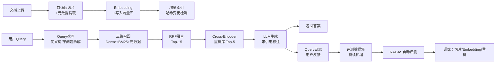

# RAG 架构从 Demo 到生产的工程化路径

> 一份构建过 3 个生产级 RAG 系统的趟坑总结，不是"对接个 LLM + 向量库就跑"的入门教程。

---

## 1. 为什么大多数 RAG Demo 上不了生产？

你照着 LangChain 的 Quickstart 搭了一个"上传 PDF → 切片 → 存向量库 → 问答"的流程，本地跑得挺顺。推到生产环境后，用户第一句就问："为什么搜不到我上周上传的那份合同里的违约金条款？"

**Demo 和生产之间存在五道鸿沟**：

| 维度 | Demo | 生产 |
|------|------|------|
| 切片 | 固定 500 token 一刀切 | 按文档结构自适应切分 |
| 检索 | 单路向量相似度 | 多路召回 + 重排序 + 元数据过滤 |
| 上下文 | 塞 Top-K 进 prompt | 动态窗口 + 引用溯源 |
| 评测 | 肉眼看看"像不像" | 自动化 RAGAS / TruLens 打分 |
| 运维 | 单进程跑完拉倒 | 增量索引、向量库高可用、query 日志 |

下面按这五道关口逐一拆解。

---

## 2. 切片策略：别把一句话劈成两半

固定长度切片是最常见的翻车点——把"甲方应在收到发票后 30 日内支付款项"切成两段，模型读到前半句"甲方应在收到发票后 30 日内"就答"不清楚支付对象"。

### 自适应分片方案

```python
from langchain_text_splitters import RecursiveCharacterTextSplitter, MarkdownHeaderTextSplitter

# 方案 A：Markdown 文档用标题结构天然分片
headers_to_split_on = [
    ("#", "h1"),
    ("##", "h2"),
    ("###", "h3"),
]
md_splitter = MarkdownHeaderTextSplitter(headers_to_split_on)
chunks = md_splitter.split_text(markdown_text)
# 每片保留 h1/h2/h3 元数据，检索时可做标题加权

# 方案 B：通用文本用递归语义分片 + 重叠窗口
splitter = RecursiveCharacterTextSplitter(
    chunk_size=512,
    chunk_overlap=64,        # 重叠 64 字符，防边界切断
    separators=["\n\n", "\n", "。", "！", "？", ".", "!", "?", " "],
    length_function=len,
)
```

### 工程建议

- **chunk_overlap 不能省略**：即使牺牲一些存储，也要保证相邻 chunk 有 10%-15% 的重叠。边界截断导致的"查不出来"在生产环境中很难 debug。
- **元数据别浪费**：切片时尽量保留源文档名、页码、章节标题、创建时间。检索阶段做元数据预过滤能大幅缩小搜索空间。
- **不要用 embedding 长度偷懒**：有人为了省 token 把 chunk_size 设成 embedding 模型的 max_length。chunk_size 由语义完整性决定，是检索质量参数，不是成本参数。

---

## 3. 检索管道：为什么单路向量搜不够

只用 `vector_store.similarity_search(query, k=5)` 的场景，准确率天花板大概在 60%-70%。要上 85%+，需要多路召回 + 重排序。

### 三路召回架构

```
用户 query
    │
    ├─ 路1: 稠密向量检索 (语义相似)
    │    embedding → FAISS/Milvus → Top-20
    │
    ├─ 路2: 稀疏关键词检索 (精确匹配)
    │    BM25 / Elasticsearch → Top-20
    │
    └─ 路3: 元数据过滤 + 向量检索 (范围收窄)
         时间/作者/文档类型过滤 → 子空间向量检索 → Top-20
    │
    ↓
RRF 融合 (Reciprocal Rank Fusion) → Top-15
    ↓
Cross-Encoder 重排序 (bge-reranker-v2) → Top-5
    ↓
送入 LLM 生成
```

### RRF 融合代码

```python
def reciprocal_rank_fusion(results_lists, k=60):
    """
    results_lists: [[doc_id, ...], [doc_id, ...], ...]
    每路返回的是一个按相关性排序的 doc_id 列表
    """
    fused_scores = {}
    for results in results_lists:
        for rank, doc_id in enumerate(results):
            fused_scores[doc_id] = fused_scores.get(doc_id, 0) + 1 / (k + rank + 1)
    return sorted(fused_scores.items(), key=lambda x: x[1], reverse=True)
```

### 重排序：Cross-Encoder 的成本取舍

BM25 + Dense + RRF 融合后，Top-15 已经比单路 Top-5 好不少，但真正把准确率拉上 90% 的是 Cross-Encoder 重排序。

```python
from sentence_transformers import CrossEncoder

reranker = CrossEncoder("BAAI/bge-reranker-v2-m3")

def rerank(query: str, candidates: list[str]) -> list[tuple[str, float]]:
    pairs = [(query, doc) for doc in candidates]
    scores = reranker.predict(pairs)
    return sorted(zip(candidates, scores), key=lambda x: x[1], reverse=True)
```

**成本估算**：单次 query 对 15 个候选做 Cross-Encoder 打分，在 CPU 上约 200-400ms。对于用户交互式场景可接受；对于批量处理场景建议只用 RRF 融合结果。

---

## 4. 引用溯源：让用户知道答案"从哪来的"

生产级 RAG 和 Demo 的另一道分水岭是**可验证性**。用户不仅要答案，还要求证。

### 实现思路

每个 chunk 入库时打上溯源标签：

```python
chunk_metadata = {
    "source": "合同_WX20240315_甲乙方代理协议.pdf",
    "page": 3,
    "chunk_index": 7,
    "section": "第六条 违约责任",
    "created_at": "2024-03-15T10:30:00Z",
}

# 生成时要求 LLM 标注引用
prompt_template = """
基于以下上下文回答问题，并在每个关键事实后标注引用编号（如 [1], [2]）：

[1] {chunk_1_metadata.source} P{chunk_1_metadata.page}:
{chunk_1_text}

[2] {chunk_2_metadata.source} P{chunk_2_metadata.page}:
{chunk_2_text}

问题：{query}
请给出答案，确保所有关键事实都有引用标注。
"""
```

LLM 输出示例：

> 违约金为合同总金额的 20% [1]，甲方应在收到发票后 30 日内支付 [2]。

前端渲染时，[1] 和 [2] 可点开展示原文片段和文档链接。

---

## 5. 评测体系：别凭感觉判断

人工评测 100 条 query 要花半小时，而且不可复现。RAG 系统至少需要三个自动化评测维度：

```python
from ragas import evaluate
from ragas.metrics import (
    faithfulness,          # 答案是否忠实于检索到的上下文
    answer_relevancy,      # 答案是否切题
    context_recall,        # 上下文是否覆盖了参考答案所需信息
    context_precision,     # 检索到的上下文有多少是相关的
)

result = evaluate(
    dataset=eval_dataset,  # 需要 ground truth 的标注数据集
    metrics=[faithfulness, answer_relevancy, context_recall, context_precision],
)
```

### 工程建议

- **ground truth 数据集至少 200 条**：100 条的统计意义有限，一个异常 query 就能把指标拉偏 2-3 个百分点。
- **faithfulness 是最硬指标**：其他三个维度可以通过加结果数量来灌水，只有 faithfulness 衡量的是"模型有没有胡说"，这个出问题 = 事故。
- **每次索引重建/模型切换后必须全量重评**：向量模型的 minor version 升级都可能导致检索分布漂移。

---

## 6. 生产运维三板斧

### 6.1 增量索引

全量重建索引在百万级文档时动辄数小时，必须支持增量：

```python
# 方案：基于文档哈希检测变更 + 按文档范围局部重索引
def incremental_index(docs: list[Document]):
    for doc in docs:
        new_hash = hashlib.md5(doc.content.encode()).hexdigest()
        old_hash = redis.get(f"doc_hash:{doc.doc_id}")

        if old_hash != new_hash:
            # 先删旧 chunk，再写新 chunk
            vector_store.delete(filter={"doc_id": doc.doc_id})
            chunks = splitter.split(doc)
            vector_store.add(chunks)
            redis.set(f"doc_hash:{doc.doc_id}", new_hash)
```

### 6.2 Query 日志闭环

每一条用户 query 都应该记录：

```python
query_log = {
    "query_id": uuid4(),
    "query_text": "违约金比例是多少",
    "retrieved_chunks": [...],   # 检索结果
    "reranked_chunks": [...],    # 重排后结果
    "llm_response": "...",
    "user_feedback": "thumbs_up",  # 隐式反馈（点了引用链接）
    "latency_ms": 1450,
    "timestamp": datetime.now().isoformat(),
}
```

这些日志是评测数据集持续扩增的来源——低分 query 人工标注后加进 ground truth，形成飞轮。

### 6.3 向量库选型

| 场景 | 推荐 | 理由 |
|------|------|------|
| 单机 < 10 万文档 | FAISS | 零运维，性能极好 |
| 分布式 / 百万级 | Milvus | 支持增量、混合查询、集群 |
| 已有 ES 的团队 | Elasticsearch 8.x+ | 原生支持 dense_vector + BM25 混合 |
| 云原生 | Pinecone / Weaviate Cloud | 免运维，按量付费 |

---

## 7. 一张图总结



---

## 8. 关键决策检查清单

启动一个生产级 RAG 项目前，逐条确认：

- [ ] 切片策略是否按文档类型（Markdown / PDF / 纯文本）做了自适应？
- [ ] chunk_overlap 是否至少设置了 chunk_size 的 10%？
- [ ] 检索是否至少包含 Dense + BM25 两路？是否加了 RRF 融合？
- [ ] 是否引入了 Cross-Encoder 重排序？
- [ ] 答案是否带引用溯源标记？
- [ ] 是否有自动化评测流水线（RAGAS / TruLens）？
- [ ] 是否支持增量索引而不需要全量重建？
- [ ] query 日志是否闭环（反馈 → 标注 → 评测数据集）？

其中最后三条是区分"能用"和"能运维"的关键。

---

*下一篇预告：信贷风控方向——「评分卡模型的变量分箱：等频 vs 等距 vs 决策树，选错了代价多大？」*
---